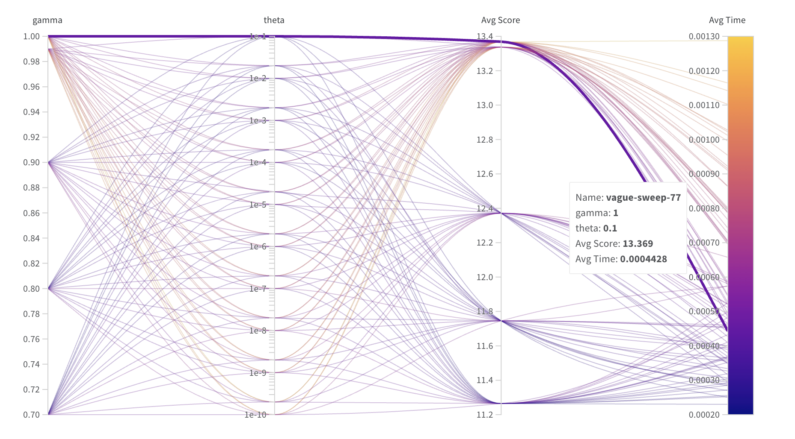

### Dice Game with Value Iteration

#### Abstract
This Python project solves a variant of a game of dice by constructing an agent that chooses the best action using the value iteration
algorithm and one-step look ahead heuristic in order to maximise score.

#### Introduction
##### The Game
The dice game in question consists of the following:
1.  Start with 0 points 
2.  Roll the dice  
3. Now choose one of the following:  
3.1. Stick: accept the values shown. If two or more dice show the same values, the total is then added to your points and this is your final score.  
3.2. Reroll the dice. You may choose to hold any combination of the dice on the current value shown. Rerolling costs you 1 point – so during the game and perhaps even at the end your score may be negative. You then make this same choice again.

##### Objectives
The task presented was to build an agent that maximises the final score based on optimising expected values, given the rewards and actions available to it.

#### Method
It was decided to use the value iteration algorithm which selects the action 
that maximises the expected utility of the given state, which itself is calculated using the Bellman equation.

The expected utility of any given game state (the current executed dice rolls) is the reward for that state plus the expected (discounted) utility of the following state [1].

##### Process
Upon initialisation of the agent a dictionary `V` is calculated which contains every possible state as the keys and a list of the expected utility/reward and the optimal policy
for each state as the values. The expected rewards are calculated using the Bellman Update equation[1] by iterating over each action available for each state, calculating every possible next state reachable from that action (aka 'one-step lookahead'), and the associated rewards obtained and probabilities of reaching that state.

This entire process is itself performed in a while-loop as the one-step look ahead relies on next state values contained within `V` which are initialised to zero and are unconverged. As each states expected reward is re-calibrated/updated it eventually converges and the loop terminates.

The value iteration continues until the <i>change</i> in expected values is less than a predetermined number, `theta` (see Parameter Optimisation below).

Once `V` converges, then the game begins. For each roll of the dice, the action to take is determined by looking up the given state to get the optimal policy.

Note that the actions are deterministic in nature as the agent will always perform only the specified action, which simplifies the calculation of the Bellman update. 

#### Parameter Optimisation
There are two parameters that must be pre-determined:
1. The discount rate, `gamma`
2. The convergence threshold, `theta`

In order to find the optimum values for the above two parameters, the agent was tested over many different values for both theta and gamma for 10,000 games each time using the Weights & Biases hyperparameter optimisation package (https://wandb.ai/home).

The above chart shows the effect of varying `gamma` and `theta` upon the average time per game and average score. 
It becomes clear that there is a trade-off between obtaining the highest score and the quickest time per game, as in 
'Avg Score' all the higher-end scores are associated with higher average times.

Furthermore, it is noted that the highest average scores were associated with higher values for `gamma`, and `theta` had no discernible effect
on the average score, only upon the average time. Therefore, it is prudent to choose `gamma=1` initially, and subsequently selecting `theta=0.1`
 as this will deliver the highest average score in the quickest time. This is shown in the highlighted line & box in the above chart.
 
The chart below demonstrates the clear relationship of average score (y-axis) to `gamma` (x-axis), with increasing values of gamma resulting in increasing average scores, up to gamma = 1:

Theoretically it makes sense that the discount rate be set to 1, as the only objective the agent must achieve is the highest 
possible score. Setting gamma < 1 would serve to penalise the agent for not selecting the 'stick' action sooner, potentially 
 forcing it to make sub-optimal decisions. However given that the reward for each re-roll is -1, it is in the best interests 
 of the agent to try to terminate the game sooner rather than later (given a sole objective), so there is no chance that the agent will 
 'prefer' to just keep re-rolling infinitely, which is one of the purposes that the discount rate is designed to mitigate. 

<i>The script used to find the optimal parameters is found in DiceGame-ParameterOptimisation.ipynb</i>

#### Results
To conclude, the results of the value iteration algorithm with parameters Gamma = 1 and Theta = 0.1, over a sample of 1000 games
gave an average score of 13.368 and an average time per game of 0.0004 seconds. 

##### References
[1] Norvig, Peter, & Russel, Stuart "Artificial Intelligence : A Modern Approach 3rd Edition" pp 652-656 Pearson Education Limited, 2016